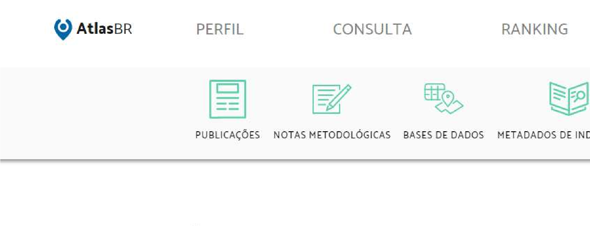
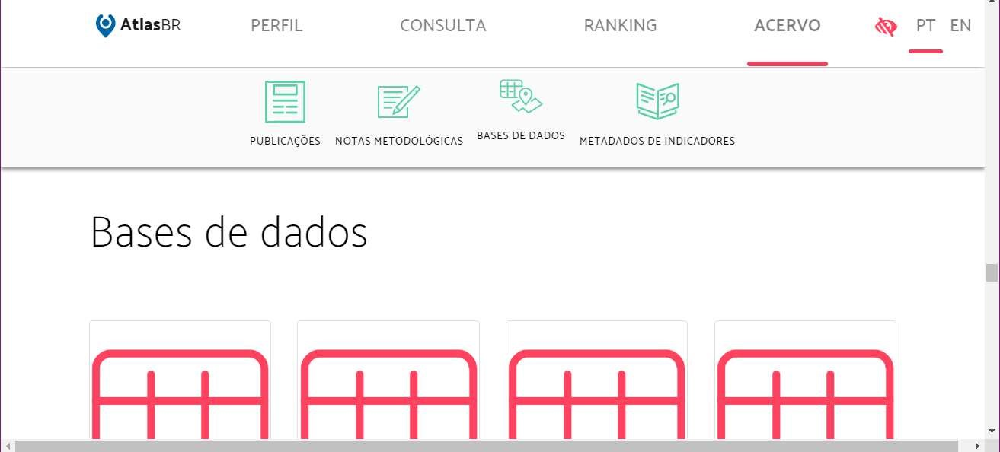
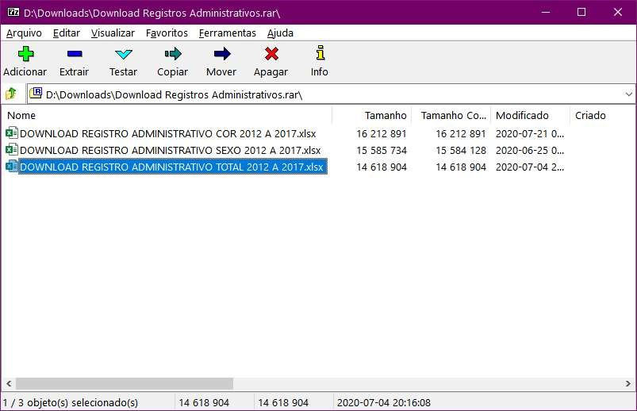

# Aula 2 - anexo como baixar dados do atlas brasil

Acessar as planilhas com os dados do Atlas Brasil

1º) Entre no site do Atlas Brasil e vá para Acervo e depois biblioteca

http://www.atlasbrasil.org.br/acervo/biblioteca

.jpeg>)

http://www.atlasbrasil.org.br/acervo/biblioteca

2º) Entre em **Acervo/biblioteca**

.png>)

3º) Procure por **Censo Demográfico** e **Registros Administrativos**

.png>)

.png>)

55

4º) Baixe para o seu computador dois arquivos:

* Bases Censo.zip
* Download Registros Administrativos.rar

.png>)

Os dois arquivos estão compactados.

5º) Abra os arquivos:

•Bases Censo.zip

•Download Registros Administrativos.rar

.png>)

57

6º) Em Bases Censo.zip abra o arquivo:

Atlas 2013\_municipal estadual e Brasil.xlsx

.png>)

.png>)

Atlas 2013\_municipal estadual e Brasil.xlsx

Vá para a planilha Siglas e veja os

indicadores disponíveis

59

* Abra a base
* Download Registros Administrativos.rar

.png>)

60

