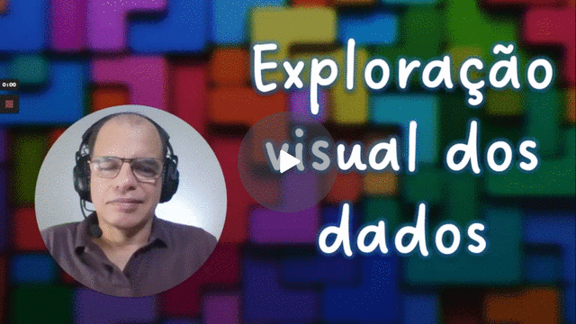
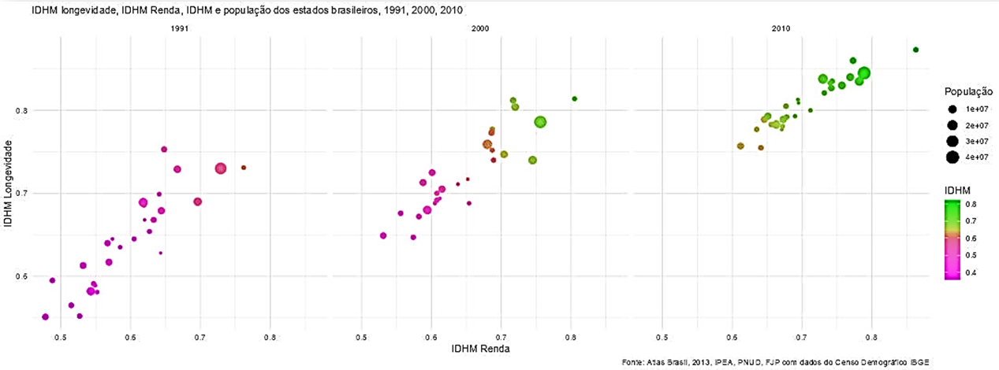

# Aula 3  - Os primeiros passos da análise de indicadores com o RStudio

Aula 3 - Os primeiros passos: exploração visual com o RStudio

### Objetivo 

Aprender a utilizar recursos de **exploração visual de dados**, com os pacotes **ggplot** (**tidyverse**) e **esquisse**, tendo como exemplo a planilha com indicadores estaduais do Atlas Brasil, IPEA/PNUD/FJP - Censo Demográfico IBGE 1991, 2000 e 2010. A exploração visual de dados é um primeiro passo para se conhecer as variáveis disponíveis para análise, formular questões e estabelecer estratégias de verificação de hipóteses com os dados. Essa parte do curso tem por objetivo também tornar o RStudio mais familiar para o posterior desenvolvimento de scripts.

### Videoaulas 

[**Aula 3 - parte 1 - Pacotes tidyverse e esquisse para visualização rápida de dados no RStudio - Watch Video**](https://youtu.be/Iv4vfGUC-ko)

[**Aula 3 - parte 2 - Visualização exploratória de dados com o pacote esquisse e ggplot - Watch Video**](https://youtu.be/T1aV4Otj48o)

### A importância dos pacotes no R 

Os pacotes ( packages ) são conjuntos de funções que estendem as funcionalidades básicas do R. São escritos pela comunidade de usuários e desenvolvedores de diversas áreas ao redor do mundo. Já são mais de 13 mil pacotes disponíveis no repositório CRAN, que podem ser baixados e instalados em seu computador.

[https://cran.r-project.org/web/packages/available\_packages\_by\_name.html](https://cran.r-project.org/web/packages/available\_packages\_by\_name.html)

O diretório local onde o R guarda os pacotes é denominado de biblioteca ( library ). Um pacote contém scripts prontos e agrupados (ou “empacotados”), que o usuário carrega na memória do programa para acessar suas funções quando necessário.

Os pacotes são desenvolvidos para atender fins específicos. A modularidade dos pacotes impulsionou a popularização do R, permitindo o envolvimento de uma vasta comunidade internacional de profissionais e acadêmicos de diferentes áreas.

Em uma biblioteca estão os arquivos de pacotes que estão instalados no computador e disponíveis para uso do R. Um pacote é instalado com a função **install.packages(“nome\_do\_pacote”)**.

Uma biblioteca é um diretório ou pasta no seu computador. Os pacotes são os scripts guardados nessa pasta.

Para que as funções contidas nos scripts de um pacote possam ser executadas, é necessário carregá-lo para a memória do R.

A função **library("nome\_do\_pacote")** torna o pacote disponível para uso.

Se a função **library( )** for utilizada sem nenhum parâmetro, o R mostrará os diretórios onde estão localizadas as bibliotecas (pode haver mais de um diretório) e uma lista dos pacotes instalados com suas respectivas descrições sumárias.

Quando o R é iniciado, alguns pacotes já são automaticamente carregados para a memória, como por exemplo o pacote {base}. Estes pacotes, definidos pelos desenvolvedores do “R Core Team”, são adicionados à biblioteca do R junto com a instalação do programa. O grupo chamado “R Core Team” é o responsável por gerenciar o desenvolvimento e as atualizações do próprio R. Os pacotes pré-instalados possuem várias funções de estatística básica, tratamento de arquivos e recursos utilitários.

Os pacotes criados pela comunidade estendem ou procuram “melhorar” a forma como o R executa algumas tarefas de forma extremamente adaptada a quase todos os campos de pesquisa baseados em análise de dados. Por isso, os pacotes são tão importantes.

### **Agora é com você** 

1. Instale os pacotes **tidyverse** e **esquisse** no RStudio. Na janela do terminal do R no RStudio digite as instruções:
   1. install.packages("tidyverse", dependencies = TRUE)
   2. install.packages("esquisse", dependencies = TRUE)
2. Importe o arquivo “Atlas 2013\_municipal, estadual e Brasil.xlsx”, que foi baixado do site Atlas Brasil na aula anterior
3. Utilizando o addin esquisse, gere um gráfico de dispersão com as variáveis IDHM\_L no eixo Y, IDHM\_R no eixo X, pesotot como tamanho dos pontos (size) e IDHM como a cor dos pontos.
4. Modifique as cores a seu critério.
5. Insira um título, fonte, rótulos para os eixos X e Y, e rótulos para as legendas.
6. Exporte o gráfico como figura JPEG

O gráfico deverá ficar semelhante ao gráfico seguinte (exceto as cores, que você pode definir de acordo com sua preferência):

Explore mais os dados. Gere outros gráficos com indicadores que que tenha curiosidade em fazer uma primeira análise exploratória.&#x20;

#### Sobre esse conteúdo 

Este conteúdo digital é parte do curso online "Introdução aos Indicadores Sociais com o software R", de autoria do Prof. Ronaldo Baltar e da Prof.ª Cláudia Siqueira Baltar, como atividade do Projeto de extensão "Indicadores sociais como subsídio para o monitoramento e avaliação das ações dos municípios paranaenses em direção à Agenda 2030", vinculado ao ObPPP (Observatório de Populações e Políticas Públicas) e ao InfoSoc (Informática aplicada à Pesquisa Social), ambos projetos do Dept.º C. Soc. - CLCH/UEL.
