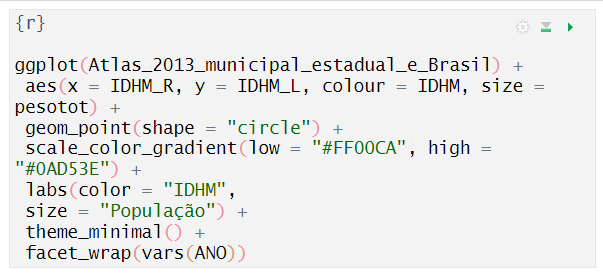

# Aula 6 - Criando documentos Rmarkdown

.jpeg>)

Aula 6 - Criando documentos RMarkdown

### Objetivo 

Aprender a criar documentos com Rmardown

### Videoaula 

[**Criando um documento Rmarkdown - Watch Video**](https://www.loom.com/share/df58d6b571fd4ad1966775832c3a3355)

[.gif>)](https://www.loom.com/share/df58d6b571fd4ad1966775832c3a3355)

### Diferença entre Scripts e Rmarkdown 

O RStudio permite a criação de vários tipos de textos, pacotes, programas e até _sites_ ou _blogs_ na Internet.

O mais básico de todos é o _Script_, que contém os códigos que podem ser salvos e recuperados posteriormente. Um script nada mais é do que um arquivo de texto simples, sem formatação, que contém instruções que podem ser executadas pelo terminal do R.

### Scripts 

Como já vimos, o R foi criado nos anos 80 a partir do _software_ S, que tinha por novidade na época, permitir a interação direta do usuário com o computador.

Vale lembrar que, naquela época, antes da difusão dos microcomputadores, os usuários raramente interagiam com os computadores diretamente.

Nos chamados _mainframes_, os programas eram escritos em folhas numeradas e depois transcritos em cartões perfurados. Os cartões eram lidos pela leitora de cartões acoplada ao computador, interpretado e os códigos eram executados. O resultado saía em uma folha impressa.

Se o programador ou usuário que estivesse executando o programa detectasse algum erro ou quisesse testar outros modelos, alterar um parâmetro, enfim, fazer qualquer mudança, tinha que novamente escrever o código em papel, nas folhas especialmente numeradas. Das folhas, alguém da digitação (profissionais especializados para essa função) transcreviam o código para os cartões, que eram novamente lidos e executados pelo computador. O usuário ficava esperando o resultado impresso, que poderia levar alguns dias para retornar. Usuários do SPSS, em seus primeiros tempos, executavam os códigos dessa maneira, por meio de cartões perfurados.

Com o software S, o usuário poderia executar uma função interativamente no computador e já obter uma resposta imediata, incluindo gráficos, como em uma calculadora. Isso representava um grande avanço para a época. O R foi criado, simulado o S, com essa mesma funcionalidade.

A interação pelo console é ótimo para a execução de poucas linhas de código, mas uma grande dificuldade para programas maiores. O S já tinha a função de salvar e ler _scripts_ desde as suas primeiras versões, que eram chamadas de macros.

Mas, com o tempo, cada vez mais os usuários foram demandando recursos mais avançados para escrever códigos e salvá-los no computador. Por isso, o RStudio foi criado, como um ambiente integrado que permite tanto o uso interativo do R, quanto a criação fácil de textos de _scripts_.

### Rmarkdown 

E se pudéssemos inserir os _scripts_ em um documento de texto já pronto para ser publicado, seja na Internet (no formato html), seja como pdf ou como um documento do Word (docx)?

A equipe do RStudio criou essa possibilidade com o pacote **Rmarkdown** que trabalha em conjunto com o pacote **Knitr**, criado por Yihui Xie.

Essa ideia implementa uma solução de documentos dinâmicos, já proposta há muito tempo por Donald Knuth. No ano de 1984, ele idealizou o processo que denominou de _literate programing_ (algo como programação alfabetizada ou letrada). O objetivo de Knuth era combinar texto em [Latex ](https://pt.wikipedia.org/wiki/LaTeX)direto com os códigos de programação, para que a parte analítica de um artigo (ou seja, o texto explicando um gráfico, por exemplo), pudesse ser escrita juntamente com o código que gera o gráfico.

Vinte anos depois, em 2004, John Gruber e Aaron Swartz criaram um sistema de marcação de texto simples, chamado de [markdown](https://pt.wikipedia.org/wiki/Markdown), que permite a conversão de documentos para o formato básico da Internet (html). O RStudio adaptou o markdown para ser usado pelos programas em R, assim surgiu o [Rmarkdown](https://rmarkdown.rstudio.com/).

Um documento Rmarkdown é composto de textos e códigos ou pedaços de _script_ do R (chamados de _chunks_). O resultado final pode ser exportado como uma página da Internet, um pdf pronto para publicação, um documento do Word com gráficos e textos, livros, artigos, sites, apresentações powerpoint, beamer, latex e muitos outros formatos.

O Rmarkdown é um grande avanço. Permite a criação de vários tipos de documentos. Mas é muito importante ter em mente que o Rmarkdown não substitui um script. O Rmarkdown é a combinação de scripts com texto e os gráficos e tabelas resultantes. A maior parte do trabalho de análise de dados é feita com scripts. Quando os scripts estão testados, depurados e funcionando como se espera, com resultados interessantes para serem disseminados, aí então, entra a vez do Rmarkdown.

Os documentos gerados pelo Rmardown são criados para as outras pessoas lerem. Os scripts são criados para você e sua equipe compreenderem os dados.

### Agora é com você 

1. Siga o passo a passo a seguir para criar um documento Rmarkdown a partir do script gerado na Aula 5, com o resultado do gráfico com o IDHM renda, IDHM longevidade, IDHM e tamanho da população para os estados do Brasil.
2. No texto, acrescente seus comentários sobre suas impressões da relação entre IDHM Longevidade, Renda, IDHM e tamanho da população para o Brasil.
3. Salve seu documento como html e publique no site [RPubs](https://rpubs.com/) (é necessário criar uma conta gratuita, conforme demonstrado na videoaula). Caso não queira usar o serviço do RPubs, salve o seu documento como Word ou pdf.
4. Anexe o link do seu documento em RPubs, ou anexe o seu documento gerado no formato word ou pdf (como preferir).

Seu documento final deverá ficar como o exemplo mostrado no vídeo, que pode ser encontrado no seguinte link:

[https://rpubs.com/baltar/exercicio1](https://rpubs.com/baltar/exercicio1)

### Passo a Passo 

1. Crie um novo documento Rmarkdown, dê um título e coloque o seu nome

1. Deletar o conteúdo criado automaticamente pelo RStudio como exemplo de documento Rmarkdown, exceto o primeiro _chunk_ de script R.

Cada pedaço/chunk contém uma parte do script que será executado juntamente com o texto do documento. Um chunk em Rmardown começa e termina com a seguinte marcação \`\`\`

Se você clicar no modo Source (que mostra a fonte do código Rmarkdown) verá o seguinte código:

No modo visual, o chunk aparece como:

Esse código significa que o script inserido nesse chunk deve ser executado como r (poderia ser python, ou outra linguagem). O nome desse chunk foi dado como setup (configuração). Nomear um chunk é apenas uma forma de documentar o código. Os nomes podem ser arbitrários, mas não devem conter espaços. A opção seguinte, após a vírgula, informa para o compilador que esse chunk não deve ser incluído no texto. Depois das instruções entre colchetes {r setup, include = FALSE} vem o código do script em R propriamente. Esse código localiza no pacote knitr a função

opts\_chunk$set() para definir que a opção echo deve ser definida por padrão como TRUE, isto é, os códigos inseridos nos chunks devem ser inseridos no documento final.

Apenas para destacar, a primeira parte de um documento Rmarkdown contém um registro YAML (Yet Another Markup Language), que contém a configuração do documento. O código YAML fica entre os marcadores ---

1. Insira no primeiro chunk a instrução para carregar o pacote ggplot2 (você pode copiar e colar do script que você fez). O chunk setup ficará assim:

Para agilizar a execução do script, salve no formato RData (o formato de dados do R) os dados do Atlas que havia sido convertido do excel para o R. Assim, quando o documento Rmardown for compilado, não será necessário converter novamente os dados. Salve na pasta dados do seu projeto como atlas\_tbl.RData.

1. Ainda para manter o seu diretório do projeto organizado, crie uma pasta para armazenar os seus documentos criados com Rmardown, vamos chamá-la de relatorio\_rmd

1. Entre na pasta relatorio\_rmd e transforme-a no diretório padrão de trabalho, clicando no botão de engrenagem e escolhendo a opção set as working directory

1. Salve o seu documento Rmardown no diretório criado, clicando no botão de disquete na aba do documento ou clicando Control+S. Dê o nome que preferir ao documento.

1. Escreva uma introdução de um parágrafo para o seu texto, explicando o que será tratado nos dados.

Para formatar o parágrafo como título, ou as palavras como itálico, clique nas opções da barra de formatação.

1. Crie um segundo chunk para inserir o script com a função ggplot(). Para inserir um chunk, clique uma barra / em parte em branco do texto, depois escolha a opção R Code Chunk

Em seguida insira o código do script ggplot (copie e cole do script)

8\) Escreva um parágrafo de comentário sobre o gráfico e uma conclusão também de algumas linhas.

1. Execute a função Knit para compilar o documento no formato html

9\) Envie o documento para Rpubs.com (se for a primeira vez, crie uma conta para você)

1. Finalize essa atividade e envie o link como anexo em um post no Mural do Google Sala de Aula. Se não quiser usar o serviço RPubs, faça a compilação do documento como word ou pdf e anexe em um post no Mural.

Para auxiliar, segue os códigos a serem inseridos no documento

Primeiro chunk R a ser inserido no documento

\`\`\`{r setup, include=FALSE}

knitr::opts\_chunk$set(echo = TRUE)

\# 1. Carregar pacotes necessários

library(ggplot2)

\# 2. importar dados

load("../dados/atlas\_tbl.RData")

\`\`\`

Segundo chunk R a ser inserido no documento

\`\`\`{r}

ggplot(Atlas\_2013\_municipal\_estadual\_e\_Brasil) +

aes(x = IDHM\_R, y = IDHM\_L, colour = IDHM, size = pesotot) +

geom\_point(shape = "circle") +

scale\_color\_gradient(low = "#FF00CA", high = "#0AD53E") +

labs(color = "IDHM",

size = "População") +

theme\_minimal() +

facet\_wrap(vars(ANO))

\`\`\`

#### Sobre esse conteúdo 

Este conteúdo digital é parte do curso online "Introdução aos Indicadores Sociais com o software R", de autoria do Prof. Ronaldo Baltar e da Prof.ª Cláudia Siqueira Baltar, como atividade do Projeto de extensão "Indicadores sociais como subsídio para o monitoramento e avaliação das ações dos municípios paranaenses em direção à Agenda 2030", vinculado ao ObPPP (Observatório de Populações e Políticas Públicas) e ao InfoSoc (Informática aplicada à Pesquisa Social), ambos projetos do Dept.º C. Soc. - CLCH/UEL.
