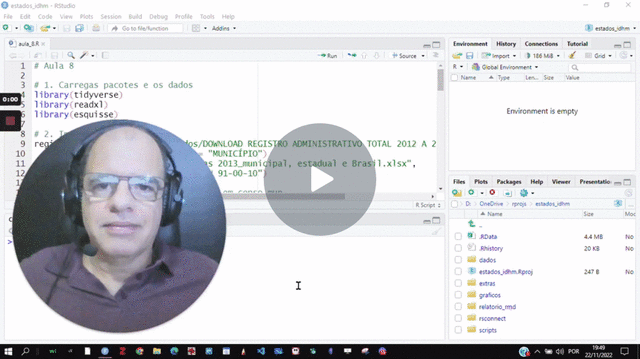

# Aula 8 - Gramática dos gráficos

.jpeg>)

Aula 8 - Gramática dos gráficos

### Objetivo 

Aprender os fundamentos da gramática dos gráficos, base para o {ggplot2}. Também vamos aprender a unir duas tabelas com a função joint() do pacote {dplyr} e explorar a análise visual de um gráfico com o {esquisse}.

### &#x20;

### Videoaula 

[**Gráficos com ggplot2 e esquisse: a gramática dos gráficos - Watch Video**](https://youtu.be/MIHk0D40ua8)

[.gif>)](https://youtu.be/MIHk0D40ua8)

[**Juntando duas tabela (dplyr::join) para análise visual gráfica com esquisse e ggplot2 - Watch Video**](https://youtu.be/CXDrGu07HEc)

[.gif>)](https://youtu.be/CXDrGu07HEc)

[**Gráficos com esquisse, ggplot2 e função joint() no RStudio - Watch Video**](https://youtu.be/eSbaJNZcqdc)

### Script utilizado nas videoaulas 

\
\# Aula 8

\# 1. Carregar pacotes e os dados

library(tidyverse)

library(readxl)

library(esquisse)

\# 2. Importar dados

registro\_mun <- read\_excel("dados/DOWNLOAD REGISTRO ADMINISTRATIVO TOTAL 2012 A 2017.xlsx",

sheet = "MUNICÍPIO")

censo\_mun <- read\_excel("dados/Atlas 2013\_municipal, estadual e Brasil.xlsx",

sheet = "MUN 91-00-10")

\# 3. Selecionar e modificar variáveis em censo\_mun

\# Criar uma variável com o município por

\# classe de tamanho de população

\# classe de tamanho da população Total IBGE

\#

\# Até 5.000

\# 5.001 a 20.000

\# 20.001 a 100.000

\# 100.001 a 500.000

\# Mais de 500.000

\#

\# Classificação ONU para IDH e IDHM

\# Muito baixo: 0 a 04,99.

\# Baixo: 0,500 a 0,599.

\# Médio: 0,600 a 0,699.

\# Alto: 0,700 a 0,799.

\# Muito alto: 0,800 a 1.

\#

\# Criar a variávei Taxa de Urbanização

censo\_mun |>

select(ANO, UF, Codmun7, Município, IDHM, IDHM\_E, IDHM\_L, IDHM\_R, POP, pesotot, pesourb, pesoRUR) %>%

mutate(classe\_pop = case\_when(

(POP < 5001) \~ "1) Até 5.000",

(POP > 5000 & POP < 20001) \~ "2) 5.001 a 20.000",

(POP > 20000 & POP < 100000) \~ "3) 20.001 a 100.000",

(POP > 100000 & POP < 500000) \~ "4) 100.001 a 500.000",

(POP > 500000) \~ "5) Mais de 500.000",

)) |>

mutate(classe\_idhm = case\_when(

(IDHM < 0.5) \~ "Muito baixo",

(IDHM >= 0.5 & IDHM < 0.6) \~ "Baixo",

(IDHM >= 0.6 & IDHM < 0.7) \~ "Médio",

(IDHM >= 0.7 & IDHM < 0.8) \~ "Alto",

(IDHM >= 0.8) \~ "Muito Alto",

)) |>

mutate(taxa\_urbanizacao = (pesourb / pesotot) \* 100) |>

mutate(urbano\_rural = case\_when(

(taxa\_urbanizacao >= 50) \~ "Urbano",

(taxa\_urbanizacao < 50) \~ "Rural")) -> m1\_censo\_mun

\# Selecionar as variáveis em registro\_mun

m1\_regist\_mun <- registro\_mun |>

select(ANO, NOME, IBGE7, IDEB\_AI, IDEB\_AF)

\# filtrar anos em m1\_censo\_mun e m1\_regist\_mun

m1\_censo\_mun |>

filter(ANO == 2010) -> c2\_2010

m1\_regist\_mun |>

filter(ANO == 2013) -> r2\_2013

\# juntar tabelas pela chave do código do município de sete # dígitos do IBGE

c2\_2010 |>

full\_join(r2\_2013, by = c("Codmun7"="IBGE7")) |>

na.omit() -> j1\_censo\_reg # elimina os casos omissos

\#Executa o esquisse no navegador

esquisse::esquisser(viewer = "browser")

### Agora é com você, atividade final do curso! 

Sugerimos que você reproduza os passos da video aula para assimilar as funções, a ideia da gramática dos gráficos e também como fazer análise exploratória visual dos dados.

**Para estimular a sua autonomia com o uso do R, do RStudio e dos indicadores, que tal um desafio?**

1. A partir do seu interesse e da sua curiosidade, escolha com select() quais variáveis que quer analisar nos dados com indicadores IPEA/PNUD/FJP baseados no Censo e dos Registros administrativos
2. Se for necessário, crie ou modifique com mutate() as variáveis para atender seu interesse de análise
3. Também se for necessário, dentro da sua proposta, filtre com filter() os casos que vai analisar, por exemplo, os anos, ou estados, ou somente municípios grandes, ou, enfim o que você tiver interesse.
4. Faça uma análise exploratória visual dos seus dados selecionados com o {esquisse}.
5. Copie o código gerado pelo {esquisse} para um ou mais gráficos {ggplot2} para o seu script.
6. Faça um teste com seu scrpit para ver se está tudo funcionando corretamente.
7. Crie um documento Rmarkdown, dê um título que corresponda a sua intenção de análise.
8. Escreva uma introdução que explique par ao leitor os objetos dessa sua proposta de análise.
9. Copie os trechos de script que você criou para chunks do RMarkdown, no local onde o gráfico ou gráficos devem ser gerados no texto.
10. Escreva um ou dois parágrafos com sua análise sobre os gráficos gerados. Como se trata de uma análise exploratória visual, portanto uma análise inicial, destaque os motivos que justificariam um estudo mais aprofundado sobre esses dados apresentados.
11. Gere um arquivo html para ser publicado em RPubs, ou, se preferir, gere um arquivo docx ou pdf para ser compartilhado com o grupo.
12. Salve o seu script no diretório de projetos em uma pasta específica para os scripts em seu projeto.
13. Salve o Rmarkdown em uma pasta de arquivos RMarkdown em seu projeto
14. Salve sua área de trabalho (arquivo .RData)

#### Leitura complementar (em inglês) 

Livro online de Hadley Wickham, Danielle Navarro e Thomas Lin Pedersen sobre o ggplot2.

[https://ggplot2-book.org/](https://ggplot2-book.org/)

#### Sobre esse conteúdo 

Este conteúdo digital é parte do curso online "Introdução aos Indicadores Sociais com o software R", de autoria do Prof. Ronaldo Baltar e da Prof.ª Cláudia Siqueira Baltar, como atividade do Projeto de extensão "Indicadores sociais como subsídio para o monitoramento e avaliação das ações dos municípios paranaenses em direção à Agenda 2030", vinculado ao ObPPP (Observatório de Populações e Políticas Públicas) e ao InfoSoc (Informática aplicada à Pesquisa Social), ambos projetos do Dept.º C. Soc. - CLCH/UEL.
